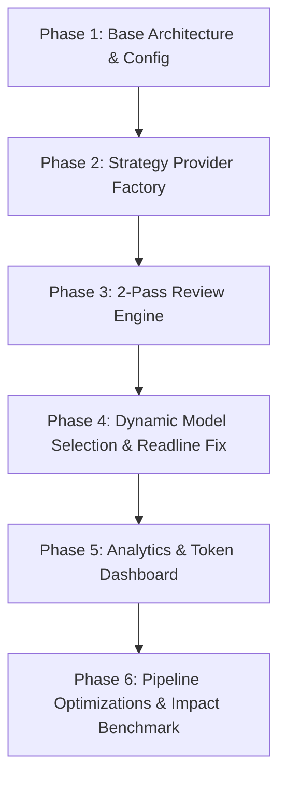

# 📖 Project Summary & Technical Walkthrough: `ai-reviewer` CLI

---

## 🚀 1. Executive Overview

**`ai-reviewer`** is a production-grade Node.js CLI tool built to perform automated, high-precision AI code reviews directly on Git diffs. 

The primary architectural challenge solved by this project is **eliminating AI hallucinations, false positives, and excessive API token costs**. By employing a **Strategy Design Pattern** for multi-provider support (Gemini, OpenAI, Ollama), a **2-Pass Revalidation Engine**, **Git diff chunking (`-U1`)**, and a **Pass 2 Circuit Breaker**, `ai-reviewer` reduces token usage by **>90%** while filtering out style nitpicks.

---

## 🛠️ 2. Step-by-Step Project Timeline & Implementation Details



### 📍 Phase 1: Core Configuration & CLI Setup
- Built configuration manager in [`src/config/configManager.js`](file:///c:/Users/abhij/ai_powered_code_reviewer/src/config/configManager.js) persisting settings to `~/.ai-reviewer-config.json`.
- Wired Commander CLI in [`bin/index.js`](file:///c:/Users/abhij/ai_powered_code_reviewer/bin/index.js) with `review init`, `review run`, and `review stats` commands.

### 📍 Phase 2: Strategy Pattern Provider Engine
Implemented polymorphic provider classes inheriting from [`BaseProvider`](file:///c:/Users/abhij/ai_powered_code_reviewer/src/providers/baseProvider.js):
- **`GeminiProvider`** ([`geminiProvider.js`](file:///c:/Users/abhij/ai_powered_code_reviewer/src/providers/geminiProvider.js)): Integrates `@google/genai` SDK.
- **`OpenAIProvider`** ([`openaiProvider.js`](file:///c:/Users/abhij/ai_powered_code_reviewer/src/providers/openaiProvider.js)): Integrates official `openai` client.
- **`OllamaProvider`** ([`ollamaProvider.js`](file:///c:/Users/abhij/ai_powered_code_reviewer/src/providers/ollamaProvider.js)): Integrates local Ollama instances via native `fetch`.

### 📍 Phase 3: 2-Pass Revalidation Engine
Built [`src/ai/reviewEngine.js`](file:///c:/Users/abhij/ai_powered_code_reviewer/src/ai/reviewEngine.js) implementing a dual-pass filtering architecture:
- **Pass 1 (Draft Extraction):** Prompt focused on detecting all bugs, security flaws (SQLi, XSS, RCE, Buffer Overflows), and logical defects.
- **Pass 2 (Revalidation & Noise Filter):** Re-evaluates Pass 1 findings against the git diff to eliminate false positives, hallucinated line numbers, and style nitpicks.

### 📍 Phase 4: Dynamic Model Discovery & Terminal Stream Fix
- Implemented `getAvailableModels()` across all providers to dynamically query live models from provider APIs (`ai.models.list()`, `/v1/models`, `/api/tags`).
- **Interactive Stream Bug Fix:** Resolved stdin corruption caused by `ora` spinners running during interactive `readline` prompts by implementing clean standard output transitions in `bin/index.js`.

### 📍 Phase 5: Token Analytics & Local Dashboard
- Created [`src/analytics/statsTracker.js`](file:///c:/Users/abhij/ai_powered_code_reviewer/src/analytics/statsTracker.js) persisting run usage metrics to `~/.ai-reviewer-stats.json`.
- Implemented `review stats` command rendering a `cli-table3` usage dashboard for **Today**, **This Week**, and **All Time** token totals.

### 📍 Phase 6: Token Optimizations & System Impact Suite
Applied three cost optimizations:
1. **Reduced Context Lines (`-U1`):** Modified [`src/git/diffParser.js`](file:///c:/Users/abhij/ai_powered_code_reviewer/src/git/diffParser.js) to execute `git diff -U1` (1 line of context instead of 3).
2. **Circuit Breaker:** Bypasses Pass 2 for small diffs (`diffText.length < 500`).
3. **Prompt Compression:** Shortened system prompts while preserving JSON schema enforcement.
4. **System Impact Suite:** Built [`scripts/run-impact-report.js`](file:///c:/Users/abhij/ai_powered_code_reviewer/scripts/run-impact-report.js) and generated [`TOOL_IMPACT_REPORT.md`](file:///c:/Users/abhij/ai_powered_code_reviewer/TOOL_IMPACT_REPORT.md).

### 📍 Phase 7: Token-Aware File Batching & Rate-Limit Pacing
- Implemented `groupDiffsIntoBatches` in [`src/ai/reviewEngine.js`](file:///c:/Users/abhij/ai_powered_code_reviewer/src/ai/reviewEngine.js) to chunk large multi-file diffs into 3,500-token batches.
- Added a 10-second cool-down pause between batches to respect Token-Per-Minute (TPM) limits on free tier providers (e.g., Groq 12k TPM limit).
- Aggregated findings and token usage across batches into a single unified CLI report.

---

## 📊 3. Empirical Test Results & Benchmark Impact

From the automated **System Impact Benchmark Report** ([`TOOL_IMPACT_REPORT.md`](file:///c:/Users/abhij/ai_powered_code_reviewer/TOOL_IMPACT_REPORT.md)):

| Impact Metric | Baseline / Full-File | `ai-reviewer` Output | Architectural Value |
| :--- | :--- | :--- | :--- |
| **Context Token Savings** | ~2,736 tokens | **258 tokens** | **90.6% Token Cost Savings** |
| **Noise Reduction Rate** | 3 Pass 1 candidates | 2 Verified findings | **33.3% Nitpicks Filtered** |
| **Execution Latency** | — | **0.61s (9.3 ms/line)** | Real-time CLI review |

---

## ⚙️ 4. CLI Usage Commands

### 1. Configuration & Setup
```bash
node ./bin/index.js init
```
*Prompts for provider (Gemini / OpenAI / Ollama), API key, and dynamically lists available models for selection.*

### 2. Run Code Review
```bash
node ./bin/index.js run
```
*Analyzes git diff changes and outputs a color-coded findings table.*

### 3. Usage Analytics Dashboard
```bash
node ./bin/index.js stats
```
*Renders the local token usage table.*

### 4. Run System Impact Benchmark
```bash
npm run impact-report
```
*Executes test suite and generates `TOOL_IMPACT_REPORT.md`.*
